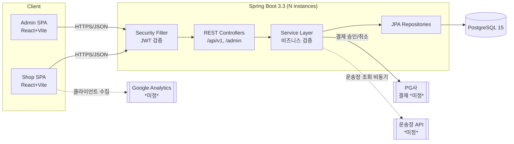
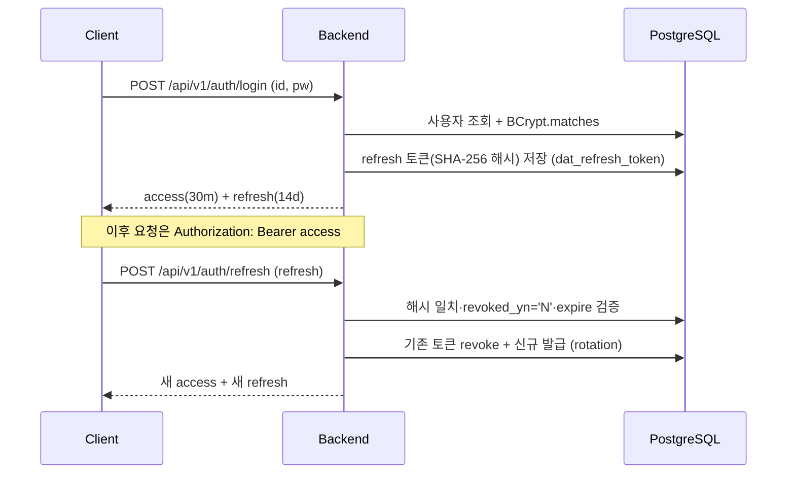
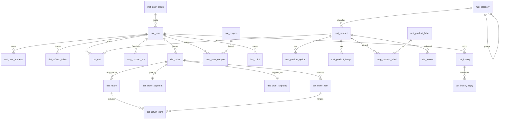

# MICOZ 프로그램 개요서 (Program Specification Document)

> **문서 목적** — 개발팀이 작업 범위·구조·결정사항을 한눈에 파악하고, 신규 합류자가 온보딩 자료로 활용하는 실무 기준 문서.
> **기준 산출물** — `micoz_schema.sql`(PostgreSQL 15, **테이블 26개**), 화면 목록(`shop/`·`admin/` JSX 프로토타입, **화면 27개** = 사용자 17 + 관리자 10).
> **작성 시점 상태** — 화면 디자인 완료 · DB 스키마 확정 · 구현 착수 직전.

---

## 1. 프로젝트 개요

**MICOZ** — 고급스러운 분위기 화장품을 판매하는 B2C 온라인 쇼핑몰.

### 배경 · 목적
고급스러운 분위기의 프리미엄 화장품 브랜드의 자사몰. 외부 오픈마켓 의존도를 낮추고 회원 등급·포인트·쿠폰 기반의 자체 리텐션 체계를 운영하기 위해 자사 커머스 플랫폼을 구축한다. 상품 카탈로그 노출부터 주문·결제·배송·교환반품·CS(1:1 문의)·리뷰까지 커머스 전 주기를 단일 시스템에서 처리하고, 관리자 백오피스에서 운영 데이터를 통합 관리하는 것이 목표다.

### 대상 사용자
| 페르소나 | 설명 | 주요 행위 |
|---|---|---|
| **B2C 고객** (`CUSTOMER`) | 회원가입한 일반 구매자. 등급(회원/VIP/마스터)에 따라 적립률 차등 | 상품 탐색·장바구니·주문·결제·리뷰·문의·교환반품 |
| **운영 관리자** (`ADMIN`) | 백오피스 운영자. 상품/주문/회원/CS/정산 데이터 관리 | 카탈로그 관리, 주문·반품 처리, 문의 응대, 통계 조회, 배너·배송 설정 |

> 비회원(게스트) 주문은 현 스키마상 미지원 — `dat_cart.user_seq`·`dat_order.user_seq`가 `NOT NULL`. (섹션 12 참조)

### 비기능 요건 (핵심)
- **성능** — 정책 평가 P99 **50ms 이하**, 피크 **~500 RPS**, 일 주문 **~1,000건**, 동시 사용자 **10,000명**.
- **가용성** — **99.9%** (월 다운타임 43분 이하).
- **보안** — JWT 기반 무상태 인증 + BCrypt(strength 12) + refresh token rotation, 로그인 enumeration 방지(섹션 8).

---

## 2. 핵심 기능

> 화면 목록(`shop/`·`admin/` JSX)의 모든 화면이 최소 한 행에 매핑되도록 작성. 데스크탑/모바일은 동일 논리 화면으로 통합.

### 2.1 사용자 영역 (Shop)

| 구분 | 기능 그룹 | 세부 기능 | 연관 화면 |
|---|---|---|---|
| 사용자 | 인증 | 로그인, 로그아웃, 토큰 갱신 | 로그인(`LoginPage`) |
| 사용자 | 인증 | 회원가입(약관·개인정보·마케팅 동의) | 회원가입(`SignupPage`) |
| 사용자 | 인증 | 아이디·비밀번호 찾기 | 아이디/비밀번호 찾기(`FindIdPwPage`) |
| 사용자 | 홈 | 히어로 배너, 추천/베스트 상품, 브랜드 소개 진입 | 홈(`HomePage`/`MobileHome`) |
| 사용자 | 브랜드 | 브랜드 스토리 소개 | 스토리(`StoryPage`/`MobileStory`) |
| 사용자 | 상품 | 카테고리·필터·정렬·페이징 목록 | 상품 목록(`ProductsPage`/`MobileProducts`) |
| 사용자 | 상품 | 상세 정보·옵션·성분·사용법·리뷰, 장바구니/찜 담기 | 상품 상세(`DetailPage`/`MobileDetail`) |
| 사용자 | 장바구니 | 수량 변경·삭제·선택 주문 | 장바구니(`CartPage`/`CartDrawer`/`MobileCart`) |
| 사용자 | 주문/결제 | 배송지·쿠폰·포인트 적용, 결제수단 선택, 주문 생성 | 체크아웃(`CheckoutPage`/`MobileCheckout`) |
| 사용자 | 주문/결제 | 주문 완료 확인 | 주문 완료(`OrderConfirm`/`MobileConfirm`) |
| 사용자 | 마이페이지 | 주문 내역 조회·상세 | 마이페이지>주문 내역(`MyPage` orders) |
| 사용자 | 마이페이지 | 취소·교환·반품 신청·내역 | 마이페이지>취소·교환·반품(`ReturnsTab`) |
| 사용자 | 마이페이지 | 찜한 제품 목록 | 마이페이지>찜한 제품(`MyPage` wishlist) |
| 사용자 | 마이페이지 | 내 리뷰 작성·조회 | 마이페이지>내 리뷰(`ReviewsTab`) |
| 사용자 | 마이페이지 | 배송지 등록·수정·삭제·기본 설정 | 마이페이지>배송지 관리(`AddressTab`) |
| 사용자 | 마이페이지 | 회원 정보·비밀번호 변경 | 마이페이지>회원 정보(`ProfileTab`) |
| 사용자 | 마이페이지 | 1:1 문의 등록·내역·상세 | 마이페이지>1:1 문의(`SupportTab`) |

### 2.2 관리자 영역 (Admin Back-office)

| 구분 | 기능 그룹 | 세부 기능 | 연관 화면 |
|---|---|---|---|
| 관리자 | 대시보드 | 매출·주문 KPI, 매출 추이 차트, 유입경로(GA) | 대시보드(`DashboardView`) |
| 관리자 | 회원 | 회원 목록·검색·등급·상태 관리, 회원 등록 | 회원관리(`MembersView`) |
| 관리자 | 카탈로그 | 2단계 카테고리 등록·수정·노출 관리 | 카테고리관리(`CategoriesView`) |
| 관리자 | 카탈로그 | 상품·옵션·이미지·라벨 등록/수정, 재고·판매상태 | 상품관리(`ProductsView`) |
| 관리자 | 커머스 | 주문 목록·검색·상세, 상태 변경, 운송장 입력 | 주문관리(`OrdersView`) |
| 관리자 | 커머스 | 취소·교환·반품 신청 처리(승인/회수/검수/완료) | 반품·교환 관리(`ReturnsView`) |
| 관리자 | CS | 1:1 문의 목록·답변 등록 | 1:1 문의(`InquiriesView`) |
| 관리자 | 설정 | 메인 히어로 배너 등록·노출·정렬 | 메인 배너 설정(`SettingsMain`) |
| 관리자 | 설정 | 기본 배송비·무료배송 기준·도서산간 추가비 | 배송 설정(`SettingsShipping`) |
| 관리자 | 설정 | 관리자 계정 추가·권한·상태 관리 | 관리자 계정 관리(`SettingsTeam`) |

> **미연결 화면 발견** — `SalesView`(매출 통계), `SettingsBrand`(브랜드 설정), `SettingsNotify`(알림 설정), `SettingsApi`(API 연동)는 프로토타입에 존재하나 관리자 라우터(`admin-app.jsx`)에 미연결. 관리자 로그인 화면 부재. → 섹션 12.

---

## 3. 기술 스택

> 핵심 트레이드오프: "검증된 단일 RDB + 무상태 인증 + 마이그레이션 코드화"로 운영 단순성과 SLO를 동시에 충족. Redis/Kafka 등 분산 컴포넌트는 도입하지 않아 운영 표면을 최소화한다.

### Backend
| 기술 | 버전 | 선정 이유 |
|---|---|---|
| Java | 17 | LTS, record/sealed 등 최신 언어 기능으로 도메인 모델 표현력 확보 |
| Spring Boot | 3.3.x | 표준 엔터프라이즈 스택, Spring Security 6/Jakarta EE 9+ 정렬 |
| Gradle (Groovy DSL) | - | 증분 빌드·의존성 관리 표준 |
| PostgreSQL | 15 | 부분 인덱스(`WHERE use_yn='Y'`)·`TIMESTAMPTZ`·`NUMERIC` 정밀도 활용, 스키마 확정 기준 |
| Spring Data JPA (Hibernate) | - | 도메인 중심 영속성, 스냅샷·소프트딜리트 패턴 구현 용이 |
| Spring Security 6 | - | 무상태 JWT 필터 체인·메서드 보안(`@PreAuthorize`) |
| jjwt | 0.12.x | access/refresh 토큰 발급·검증 표준 라이브러리 |
| BCrypt | - | 비밀번호 단방향 해시(strength 12) |
| Flyway | 10.x | DDL 변경 이력을 코드 저장소에서 추적, 환경별 일관 적용 |
| SpringDoc OpenAPI | 2.x | 코드-문서 동기화, Swagger UI 제공(운영 비활성화) |
| JUnit 5 / Mockito / Testcontainers | - | 단위(Service)·통합(실 PostgreSQL 컨테이너) 테스트 |
| Lombok | - | 보일러플레이트 제거 |

### Frontend
| 기술 | 선정 이유 |
|---|---|
| React 18 | 프로토타입(JSX)과 동일 패러다임, 컴포넌트 재사용 |
| Vite | 빠른 HMR·번들, 개발 생산성 |
| TailwindCSS | 디자인 토큰(`--cream`/`--plum-*`) 유틸리티 매핑, 일관 스타일 |
| Axios | 인터셉터 기반 JWT 자동 첨부·토큰 갱신 처리 |

### Infra
| 기술 | 선정 이유 |
|---|---|
| Docker Compose (로컬) | `postgres` + `app` 단일 명령 기동, 환경 재현성 |
| 운영 인프라 | **<!-- 확인 필요: AWS/GCP/온프레미스 미정 -->** → 섹션 12 |

### 외부 연동
| 연동 | 상태 | 비고 |
|---|---|---|
| PG(결제대행) | **확인 필요** | 스키마 `payment_type`에 KAKAOPAY/NAVERPAY/TOSS 등 enum 존재하나 실제 계약사 미정 → 섹션 12 |
| 운송장 추적 API | **확인 필요** | `tracking_no`·`shipping_status` 컬럼 존재, 택배사 API 미정 → 섹션 12 |
| GA(Google Analytics) | **확인 필요** | 대시보드 `ChannelInflow`에 유입 채널 표시, 연동 범위·이벤트 정의 미정 → 섹션 12 |

---

## 4. 시스템 아키텍처

> 핵심 설계 결정: **무상태(stateless) JWT 인증 + 단일 PostgreSQL + 결제 후처리 검증**으로 수평 확장(앱 인스턴스 N대)과 P99 50ms를 동시에 달성한다. 세션 스토어가 없어 인스턴스 간 공유 상태가 없고, 로드밸런서 뒤에서 자유롭게 스케일아웃 가능.

### 4.1 컴포넌트 구성도



### 4.2 요청 처리 흐름

```
Client → [LB] → Security Filter(JWT 파싱·권한 평가)
       → Controller(요청 검증, Bean Validation)
       → Service(비즈니스 검증·트랜잭션 경계)
       → Repository/JPA → PostgreSQL
       ↘ (결제) PG사 승인 API → 콜백/검증 → 주문 상태 전이
```

### 4.3 인증 토큰 흐름 (access + refresh)



- **Access**: 무상태 검증(서명만 확인, DB 조회 없음) → 정책 평가 P99 50ms 충족의 핵심.
- **Refresh**: `dat_refresh_token`에 SHA-256 해시로 저장, rotation 시 기존 토큰 `revoked_yn='Y'` 처리(재사용 탐지).

### 4.4 외부 연동 · 비동기 지점
- **동기**: 결제 승인(PG) — 주문 생성 트랜잭션과 연계, 승인 실패 시 롤백.
- **비동기 후보**: 운송장 상태 폴링/웹훅, 마케팅 알림, GA 이벤트 수집(클라이언트 측). *현 스택은 메시지 브로커 미도입 → Spring `@Async`/스케줄러로 처리, 외부 큐 도입은 범위 외.*

### 4.5 SLO 충족 설계 결정
- **P99 50ms** — 무상태 access 검증(DB 미접근) + 핫 경로(`mst_product`, `dat_order`)에 부분/복합 인덱스(`idx_dat_order_user_seq(user_seq, order_date DESC)` 등) 선반영.
- **가용성 99.9%** — 무상태 앱으로 인스턴스 다중화, 단일 DB는 운영 인프라 확정 시 read replica/HA 구성 검토(섹션 12).

---

## 5. 디렉토리 구조 (제안)

### 5.1 Backend — 도메인 기반 패키지

> `micoz_schema.sql`의 26개 테이블을 도메인 단위로 그룹화.

```
com.micoz
├── common/                 # 공통: 응답 포맷, 에러코드, 예외, BaseEntity(audit), 소프트딜리트
│   ├── config/             # SecurityConfig, JpaAuditingConfig, OpenApiConfig, CorsConfig
│   ├── response/           # ApiResponse<T>, ErrorCode
│   └── exception/
├── auth/                   # 로그인·토큰: dat_refresh_token
├── user/                   # mst_user, mst_user_grade, mst_user_address
├── category/               # mst_category
├── product/                # mst_product, mst_product_option, mst_product_image,
│                           #   mst_product_label, map_product_label
├── cart/                   # dat_cart, map_product_fav (찜)
├── order/                  # dat_order, dat_order_item, dat_order_payment, dat_order_shipping
├── returns/                # dat_return, dat_return_item
├── promotion/              # mst_coupon, map_user_coupon, his_point
├── review/                 # dat_review
├── inquiry/                # dat_inquiry, dat_inquiry_reply
└── settings/               # mst_banner, mst_shipping
```
각 도메인 패키지 내부: `controller / service / repository / entity / dto`. 관리자 전용 엔드포인트는 각 도메인 내 `AdminXxxController`로 분리(섹션 7).

### 5.2 Frontend — feature 기반

```
src/
├── features/
│   ├── auth/        # 로그인, 회원가입, 아이디/비번 찾기
│   ├── home/        # 홈, 브랜드 스토리
│   ├── product/     # 목록, 상세
│   ├── cart/        # 장바구니, 찜
│   ├── order/       # 체크아웃, 주문완료
│   ├── mypage/      # 주문내역·반품·찜·리뷰·배송지·회원정보·문의 (탭)
│   └── admin/       # 대시보드·회원·카테고리·상품·주문·반품·문의·설정
├── shared/          # 공통 UI 컴포넌트(Button, Modal, DataTable 등)
├── lib/             # axios 인스턴스(인터셉터), 토큰 스토리지, 포맷터
└── pages/           # 라우트 엔트리(shop/admin 분리)
```

---

## 6. 데이터베이스 설계 요약

> `micoz_schema.sql` 전체 정독 완료. 핵심 트레이드오프: **물리 FK 미설정(논리 연결만)** + **소프트 딜리트** + **주문 스냅샷**. 운영 유연성과 이력 보존을 우선하고, 무결성은 애플리케이션 서비스 레이어에서 강제한다.

### 6.1 테이블 목록 (영역별, 총 26개)

| 영역 | 테이블 | 비고 |
|---|---|---|
| 1. 사용자/권한 (4) | `mst_user_grade`, `mst_user`, `mst_user_address`, `dat_refresh_token` | 관리자·회원 `mst_user` 통합(`user_role`) |
| 2. 카테고리 (1) | `mst_category` | 2단계(대/중분류), 자기참조 `parent_seq` |
| 3. 상품 (5) | `mst_product`, `mst_product_option`, `mst_product_image`, `mst_product_label`, `map_product_label` | 옵션 없는 상품도 기본 옵션 1건 |
| 4. 장바구니/찜 (2) | `dat_cart`, `map_product_fav` | |
| 5. 주문/결제/배송 (4) | `dat_order`, `dat_order_item`, `dat_order_payment`, `dat_order_shipping` | 주문상품에 스냅샷 컬럼 |
| 6. 취소/교환/반품 (2) | `dat_return`, `dat_return_item` | CANCEL/EXCHANGE/RETURN 통합 |
| 7. 쿠폰/포인트 (3) | `mst_coupon`, `map_user_coupon`, `his_point` | 포인트는 이력 + 잔액 스냅샷(`balance_after`) |
| 8. 리뷰 (1) | `dat_review` | 평점 1~5, 이미지 URL JSON |
| 9. 1:1 문의 (2) | `dat_inquiry`, `dat_inquiry_reply` | |
| 10. 배너/배송설정 (2) | `mst_banner`, `mst_shipping` | `mst_shipping`은 단일행 설정 |

### 6.2 네이밍 컨벤션 (스키마에서 확인된 규칙)
- **테이블 접두사**: `mst_`(마스터) / `dat_`(트랜잭션 데이터) / `map_`(매핑·N:M) / `his_`(이력).
- **PK**: `{도메인}_seq`, `BIGSERIAL`. **코드성 컬럼**: `{도메인}_code`(UNIQUE).
- **상태**: `*_status` VARCHAR + 주석에 enum 값 명시(예: `order_status` PENDING/PAID/...).
- **플래그**: `*_yn CHAR(1)` (`Y`/`N`).
- **금액**: `NUMERIC(15,2)`, **포인트**: `INTEGER`, **일시**: `TIMESTAMPTZ`.

### 6.3 핵심 관계 (ERD)


> 물리 FK는 미설정(스키마 헤더 명시). 위 관계는 논리 연결이며 JPA 연관·서비스 검증으로 보장. `dat_order ↔ payment/shipping`은 주문당 1건(1:1)으로 운용.

### 6.4 소프트 딜리트 정책
- 대부분 테이블에 **`use_yn CHAR(1) DEFAULT 'Y'`** — 물리 삭제 대신 `'N'` 마킹.
- UNIQUE 인덱스는 **부분 인덱스**로 활성 행만 제약(예: `idx_mst_user_user_id ... WHERE use_yn='Y'`) → 삭제된 ID 재사용 가능.
- 예외(이력성·관계 테이블, `use_yn` 없음): `dat_cart`, `map_product_fav`, `map_product_label`, `dat_refresh_token`, `his_point`(있음), `dat_order`(있음). <!-- 확인 필요: dat_order는 use_yn 보유하나 주문은 물리 삭제 비대상 — 취소는 order_status로 표현 -->

### 6.5 공통 Audit 컬럼
- 등록: `i_user`(등록자 ID), `i_date`(`DEFAULT NOW()`).
- 수정: `u_user`, `u_date` — *이력/매핑성 테이블(`dat_cart`, `map_*`, `his_point`, `dat_refresh_token`, `dat_return_item`)에는 수정 컬럼 없음(append-only 성격).*
- 구현: JPA Auditing(`@CreatedBy`/`@CreatedDate`/`@LastModifiedBy`/`@LastModifiedDate`)으로 자동 채움(섹션 8).

---

## 7. API 설계 방향

> 핵심 트레이드오프: **표준 REST + 균일 응답 래퍼 + 도메인별 에러코드**로 프론트 처리 일관성과 디버깅 추적성을 확보.

### 7.1 원칙
- RESTful, 리소스 **명사 복수형**(`/products`, `/orders`).
- 버전 prefix **`/api/v1`**. 관리자 전용은 **`/api/v1/admin/**`** 로 분리(권한 게이팅).
- **응답 포맷(균일 래퍼)**:
  ```json
  { "code": "SUCCESS", "message": "요청 처리 완료", "data": { } }
  ```
  실패 시 `code`에 도메인 에러코드, `data`는 `null`.
- **페이지네이션**: Spring `Pageable` — `?page=0&size=20&sort=i_date,desc`.

### 7.2 에러 코드 체계 (도메인별 prefix)
| Prefix | 도메인 | 예시 |
|---|---|---|
| `AUTH_` | 인증 | `AUTH_INVALID_CREDENTIALS`, `AUTH_TOKEN_EXPIRED` |
| `USER_` | 회원 | `USER_DUPLICATED_ID`, `USER_NOT_FOUND` |
| `PRODUCT_` | 상품 | `PRODUCT_SOLD_OUT`, `PRODUCT_NOT_FOUND` |
| `CART_` | 장바구니 | `CART_OPTION_REQUIRED` |
| `ORDER_` | 주문 | `ORDER_AMOUNT_MISMATCH`, `ORDER_INVALID_STATUS` |
| `PAY_` | 결제 | `PAY_APPROVAL_FAILED` |
| `RETURN_` | 반품 | `RETURN_PERIOD_EXPIRED` |
| `COUPON_` / `POINT_` | 프로모션 | `COUPON_NOT_APPLICABLE`, `POINT_INSUFFICIENT` |
| `COMMON_` | 공통 | `COMMON_VALIDATION_ERROR` |

### 7.3 화면별 주요 API 매핑 (핵심 화면 ≥10)

| 화면명 | Method | Endpoint | 설명 |
|---|---|---|---|
| 로그인 | POST | `/api/v1/auth/login` | access+refresh 발급 |
| 토큰 갱신 | POST | `/api/v1/auth/refresh` | rotation 재발급 |
| 회원가입 | POST | `/api/v1/users` | 약관·개인정보·마케팅 동의 포함 |
| 아이디/비번 찾기 | POST | `/api/v1/auth/find-id` · `/auth/reset-password` | 본인확인 후 처리 |
| 상품 목록 | GET | `/api/v1/products` | 카테고리·필터·정렬·페이징 |
| 상품 상세 | GET | `/api/v1/products/{seq}` | 옵션·이미지·라벨·성분 |
| 장바구니 | GET/POST/PATCH/DELETE | `/api/v1/cart` `/cart/{seq}` | 조회·담기·수량변경·삭제 |
| 찜 | POST/DELETE | `/api/v1/favorites/{productSeq}` | 찜 토글 |
| 체크아웃 | POST | `/api/v1/orders` | 주문 생성(쿠폰·포인트·배송지) |
| 결제 | POST | `/api/v1/orders/{seq}/payment` | PG 승인 연동·검증 |
| 주문 완료 | GET | `/api/v1/orders/{seq}` | 주문 상세 확인 |
| 주문 내역 | GET | `/api/v1/orders` | 내 주문 목록(페이징) |
| 취소·교환·반품 | POST | `/api/v1/returns` | 신청 생성(type=CANCEL/EXCHANGE/RETURN) |
| 내 리뷰 | GET/POST | `/api/v1/reviews` | 작성·조회 |
| 배송지 관리 | GET/POST/PUT/DELETE | `/api/v1/users/me/addresses` | CRUD·기본 설정 |
| 회원 정보 | GET/PUT | `/api/v1/users/me` `/users/me/password` | 정보·비밀번호 변경 |
| 1:1 문의 | GET/POST | `/api/v1/inquiries` | 등록·내역·상세 |
| 메인 배너(노출) | GET | `/api/v1/banners` | 홈 히어로 슬라이드 |
| **[관리자]** 대시보드 | GET | `/api/v1/admin/dashboard/stats` | KPI·매출 추이·유입 |
| **[관리자]** 회원관리 | GET/POST | `/api/v1/admin/users` | 목록·검색·등록 |
| **[관리자]** 카테고리 | GET/POST/PUT | `/api/v1/admin/categories` | 2단계 관리 |
| **[관리자]** 상품관리 | POST/PUT | `/api/v1/admin/products` | 옵션·이미지·라벨·재고 |
| **[관리자]** 주문관리 | GET/PATCH | `/api/v1/admin/orders` `/{seq}/status` | 상태변경·운송장 |
| **[관리자]** 반품·교환 | GET/PATCH | `/api/v1/admin/returns/{seq}/status` | 승인/회수/검수/완료 |
| **[관리자]** 1:1 문의 | GET/POST | `/api/v1/admin/inquiries/{seq}/reply` | 답변 등록 |
| **[관리자]** 배송 설정 | GET/PUT | `/api/v1/admin/settings/shipping` | 단일행 설정 |
| **[관리자]** 관리자 계정 | GET/POST | `/api/v1/admin/admins` | role=ADMIN 계정 |

> 화면 하나당 최소 1개 엔드포인트 가정 충족. 관리자 로그인 API는 화면 부재로 미정의 → 섹션 12.

---

## 8. 보안 정책

> 핵심 트레이드오프: **무상태 JWT의 확장성**을 취하되, refresh 토큰만 DB에 해시 저장·rotation하여 탈취·재사용 위험을 통제한다. (성능 vs. 폐기 가능성의 균형)

### 8.1 인증 · 토큰
- **JWT access 30분 + refresh 14일**. access는 무상태 서명 검증(DB 미접근).
- refresh는 **SHA-256 해시**로 `dat_refresh_token.refresh_token`에 저장(평문 미보관) + **rotation**(재발급 시 이전 토큰 `revoked_yn='Y'`).
- 재사용 탐지: revoked 토큰 제출 시 해당 사용자 전체 토큰 무효화.
- 발급 IP 기록(`ip_address`), 만료(`expire_date`) 검증.

### 8.2 비밀번호
- **BCrypt strength 12**로 단방향 해시(`mst_user.user_pw VARCHAR(255)`).
- 비밀번호 변경 시 모든 refresh 토큰 revoke.

### 8.3 권한
- 2단계 기본: **`CUSTOMER` / `ADMIN`**(`mst_user.user_role`).
- 경로 기반 게이팅: `/api/v1/admin/**` → `hasRole('ADMIN')`, 메서드 보안 `@PreAuthorize` 병행.
- 본인 리소스 접근 검증(주문·문의·배송지 등 `user_seq` 일치). 관리자 세부 권한 분리는 미정 → 섹션 12.

### 8.4 계정 열거(enumeration) 방지
- 로그인 실패 시 "아이디 없음"/"비밀번호 불일치"를 **동일 응답**(`AUTH_INVALID_CREDENTIALS`)으로 처리.
- 아이디/비밀번호 찾기·회원가입 중복확인도 동일 메시지 정책 적용, 응답 시간 차 최소화.

### 8.5 CORS · CSRF
- **CORS**: 허용 Origin 화이트리스트(shop·admin 도메인), `Authorization` 헤더 허용, credentials 정책은 토큰 헤더 방식이므로 쿠키 비의존.
- **CSRF**: 무상태 + 토큰 헤더 기반이므로 Spring Security CSRF **비활성화**(쿠키 세션 미사용).

### 8.6 시크릿 관리
- DB 비밀번호·JWT 서명키·PG 키 등은 **환경변수/`.env`** 주입, **코드 저장소 커밋 금지**(`.gitignore` 강제).
- 프로파일별 분리(`application-{env}.yml`)는 비밀값을 직접 담지 않고 placeholder 참조.

### 8.7 입력 검증
- **Bean Validation**(`@NotNull`/`@Email`/`@Size`)으로 형식 검증 → Controller.
- **비즈니스 검증 레이어 분리**: 금액 재계산(`final_amount` 서버 산출), 재고·쿠폰 적용가능 여부 등은 Service에서 강제(클라이언트 값 불신뢰).

### 8.8 감사 · 로깅
- `@CreatedBy`/`@LastModifiedBy`로 audit 컬럼 자동 채움(현재 인증 주체 → `i_user`/`u_user`).
- **민감정보 로깅 차단**: 비밀번호·토큰·카드번호(마스킹된 `card_no_masked`만 보관) 로그 금지.
- 운영 환경 **Swagger UI 비활성화**(`springdoc.swagger-ui.enabled=false` in prod).

---

## 9. 개발 단계 (Roadmap)

| Phase | 명칭 | 주요 산출물 | Definition of Done |
|---|---|---|---|
| Phase 0 | 기반 셋업 | 인증/공통/DB/Swagger/테스트 골격, Flyway 베이스라인 | `docker compose up`으로 앱+DB 기동, Swagger 노출, 26테이블 마이그레이션 성공 |
| Phase 1 | Auth + User | 회원가입·로그인·토큰 갱신·로그아웃, 마이페이지 회원정보 | 토큰 발급/갱신/폐기 E2E 통과, enumeration 방지 검증 |
| Phase 2 | 상품 카탈로그 | 상품 조회·검색·카테고리(읽기), 배너 노출 | 목록 필터·페이징·상세 응답 정상, P99 측정 시작 |
| Phase 3 | 장바구니 + 찜 | 장바구니·찜 CRUD | 담기→수량변경→삭제, 찜 토글 통합테스트 통과 |
| Phase 4 | 주문 + 결제 | 주문 생성·PG 연동·결제 완료 처리 | 주문→결제 승인→상태 PAID 전이, 금액 서버 재검증 통과 |
| Phase 5 | 주문 후속 | 배송 추적·리뷰·반품/교환 | 반품 신청→상태 전이, 리뷰 작성, 운송장 조회 동작 |
| Phase 6 | 마이페이지 통합 | 1:1 문의·포인트·쿠폰·배송지 | 문의 등록/답변, 포인트 적립·사용 이력 정합성 검증 |
| Phase 7 | 관리자 API | 관리자 전용 엔드포인트 전체 | `/admin/**` 권한 게이팅, 회원/상품/주문/반품/문의 처리 통과 |
| Phase 8 | 대시보드 + 마무리 | 통계 API·성능 튜닝·문서 정리 | 대시보드 KPI 응답, 핵심 경로 P99 50ms 충족, OpenAPI 문서 최신화 |

---

## 10. 배포 환경

- **로컬 개발**: Docker Compose — `postgres`(15) + `app`(Spring Boot). 단일 명령 기동, 동일 DB 버전 재현.
- **운영 환경**: **미정** (AWS/GCP/온프레미스) → 섹션 12.
- **환경 분리**: `local` / `dev` / `prod` 프로파일, `application-{env}.yml`. 비밀값은 환경변수 주입.
- **CI/CD 방향(초안)**: GitHub Actions — PR 시 `build + test`(Testcontainers), `main` 머지 시 이미지 빌드. 상세 파이프라인 추후 확정 → 섹션 12.

---

## 11. 테스트 전략

| 레벨 | 도구 | 대상 | 목표 |
|---|---|---|---|
| 단위 | JUnit 5 + Mockito | Service 레이어(금액 계산·쿠폰·포인트·상태 전이 등 비즈니스 로직) | Service 커버리지 **80% 이상** |
| 통합 | Testcontainers(실 PostgreSQL 15) | Repository·트랜잭션·소프트딜리트·부분 인덱스 동작 | 핵심 쿼리·제약 검증 |
| E2E | MockMvc/REST | **인증 → 주문 → 결제** 핵심 플로우 | 주요 해피패스 + 실패(금액 불일치·재고부족) |

- 회귀 방지: PG·운송장은 외부 의존 → 스텁/모의 서버로 격리.
- 검증 우선순위: 금액 산출 정확성, 토큰 rotation, 권한 게이팅.

---

## 12. 미해결 사항 / 추후 결정

**외부 연동 · 인프라**
- [ ] **PG 연동 사업자 확정** (토스페이먼츠 / 카카오페이 / 네이버페이 — `payment_type` enum은 다수 존재하나 실 계약사·연동 방식 미정)
- [ ] **운영 인프라 확정** (AWS / GCP / 온프레미스) — DB HA/read replica 구성 여부 포함
- [ ] **운송장 추적 API 사업자 확정** (`mst_shipping.shipping_name` 기본값 'CJ대한통운' 외 실제 연동 택배사·API)
- [ ] **GA 연동 범위 확정** (대시보드 유입경로 표시 — 수집 이벤트 목록·연동 방식 정의 필요)
- [ ] **CI/CD 파이프라인 상세 설계** (GitHub Actions 초안 → 배포 트리거·환경 승인 흐름)

**권한 · 정책**
- [ ] **관리자 권한 세분화 필요 여부** (현 스키마 `user_role`은 CUSTOMER/ADMIN 2단계뿐 — 운영/CS/정산 등 역할 분리 시 권한 모델 확장 검토)
- [ ] **관리자 로그인 화면/플로우 부재** (관리자 백오피스 라우터에 로그인 화면 미존재 — 인증 진입점 정의 필요)
- [ ] **비회원(게스트) 주문 지원 여부** (`dat_cart`·`dat_order`의 `user_seq`가 `NOT NULL` — 게스트 구매 비대상으로 확정인지 확인)

**화면 ↔ 스키마 정합성 (검토 중 발견)**
- [ ] **기능/화면 추가 검토 필요 — `SalesView`(매출 통계)**: 프로토타입에 존재하나 관리자 NAV/라우터 미연결. 별도 메뉴화 여부 결정.
- [ ] **기능/화면 추가 검토 필요 — `SettingsBrand`(브랜드 설정)**: 화면은 있으나 대응 테이블 없음. 설정 저장소(테이블/설정파일) 정의 필요.
- [ ] **기능/화면 추가 검토 필요 — `SettingsNotify`(알림 설정)**: 화면 존재, 대응 테이블 없음. 알림 채널/수신 설정 저장 방식 미정.
- [ ] **기능/화면 추가 검토 필요 — `SettingsApi`(API 연동)**: 화면 존재, 키 저장은 시크릿(환경변수) 정책과 충돌 가능 — 관리 방식 결정.
- [ ] **확인 필요 — `dat_refresh_token.refresh_token`**: 스키마 주석은 "값 또는 SHA256 해시"로 모호. 본 문서는 **SHA-256 해시 저장**으로 확정 권고(보안 정책 8.1과 정렬).
- [ ] **확인 필요 — `mst_user.email` 유니크 제약 부재**: `user_id`만 UNIQUE. 이메일 기반 본인확인/중복정책 시 제약·인덱스 추가 여부 결정.
- [ ] **확인 필요 — `dat_order.use_yn` 의미**: 주문은 물리 삭제 비대상이며 취소는 `order_status=CANCELED`로 표현. `use_yn` 활용 정책 명확화.
- [ ] **확인 필요 — 리뷰 작성 자격**: `dat_review`에 `order_seq`/`item_seq`가 nullable. 구매자만 작성(검증) 정책 적용 여부 결정.
- [ ] **확인 필요 — 재고 차감 시점/동시성**: `mst_product_option.stock_qty` 차감을 주문 생성 vs 결제 완료 중 어디서, 어떤 잠금으로 처리할지 정의(피크 500 RPS 고려).

---

<!-- 문서 끝. 기준: micoz_schema.sql(26 테이블) · shop·admin JSX 화면 목록(사용자 17 / 관리자 10). -->
